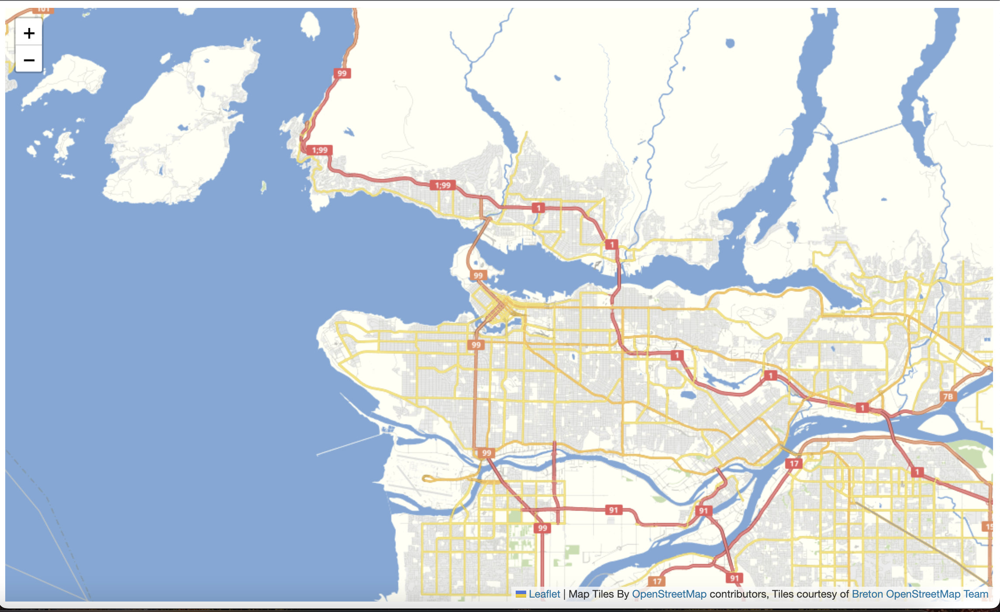

# Map Boilerplate

Below is a block of code - this is our map boilerplate. This was included in the .ZIP file that was downloaded at the start of this workshop, and now we need to open in in our source code editor. It’s important that you don’t lose any of this text, and that it remains in its original structure and arrangement.

```html
<html>
  <head>

    <title>Leaflet</title>
    <meta charset="utf-8" />
    <meta name="viewport" content="width=device-width, initial-scale=1.0">

    <!-- Source for your Leaflet JavaScript and CSS -->
    <link rel="stylesheet" href="https://unpkg.com/leaflet@1.2.0/dist/leaflet.css" integrity="sha512-M2wvCLH6DSRazYeZRIm1JnYyh22purTM+FDB5CsyxtQJYeKq83arPe5wgbNmcFXGqiSH2XR8dT/fJISVA1r/zQ==" crossorigin=""/>
    <script src="https://unpkg.com/leaflet@1.2.0/dist/leaflet.js" integrity="sha512-lInM/apFSqyy1o6s89K4iQUKg6ppXEgsVxT35HbzUupEVRh2Eu9Wdl4tHj7dZO0s1uvplcYGmt3498TtHq+log==" crossorigin=""></script>
    <script src="./ubcbuildings.js" charset="utf-8"></script>
  </head>

  <body>
    <!-- Your map's HTML container -->
    <div id="mapid" style="height: 100%;"></div>

    <!-- Script for your map between <script> and </script> -->
    <script>

      // Initialize your map, sets the initial view location and zoom level
      var mymap = L.map('mapid').setView([49.2827, -123.1207], 11);

      //Load the tile layer, paste in new tile layer of choice.
      var Stamen_Terrain = L.tileLayer('https://stamen-tiles-{s}.a.ssl.fastly.net/terrain/{z}/{x}/{y}.{ext}', {
      attribution: 'Map tiles by <a href="http://stamen.com">Stamen Design</a>, <a href="http://creativecommons.org/licenses/by/3.0">CC BY 3.0</a> — Map data © <a href="http://www.openstreetmap.org/copyright">OpenStreetMap</a>',
      subdomains: 'abcd',
      minZoom: 0,
      maxZoom: 18,
      ext: 'png'
        }).addTo(mymap);

      //Paste your marker here

      //Paste UBC buildings variable here
      //Paste the L.geoJSON function here

      //Paste popup function here

    </script>
  </body>
</html>

```

<br />
To Do
{: .label .label-green }
-  Navigate into your "intro-leaflet-workshop" folder and open the <code>boilerplate.html</code> in your web browser.**  You may need to "right-click" and "open with" your browser of choice.
<br />

### In a Browser

In your web browser, you should see a map that looks something like this:




### In a Source Code Editor
Let's look at what is making this file work using our code editor. The HTML document is split into two main sections: (1) the <code>head</code> and the (2) <code>body</code>. Each of these sections are contained within opening and closing tags.
```
<head> some stuff </head>
<body> some other stuff </body>
```

## Head
The stuff inside the <code>head</code> is the metadata for your browser about the document. Inside the <code>head</code> are things like the document’s title - in this case "Leaflet" - so that it can used for things like being displayed in your browser's tab. Additionally, there are some lines with links to the source code for Leaflet's JavaScript and CSS rules:     

```html
<link rel="stylesheet" href="https://unpkg.com/leaflet@1.2.0/dist/leaflet.css" integrity="sha512-M2wvCLH6DSRazYeZRIm1JnYyh22purTM+FDB5CsyxtQJYeKq83arPe5wgbNmcFXGqiSH2XR8dT/fJISVA1r/zQ==" crossorigin=""/>
<script src="https://unpkg.com/leaflet@1.2.0/dist/leaflet.js" integrity="sha512-lInM/apFSqyy1o6s89K4iQUKg6ppXEgsVxT35HbzUupEVRh2Eu9Wdl4tHj7dZO0s1uvplcYGmt3498TtHq+log==" crossorigin=""></script>
```

If you copy either one of those links and paste it in a new tab in your browser, you’ll see a lot of raw code. By linking to the source, we avoid having to carry this text into our own document, while also being assured that the code we're using is up-to-date.

You'll also see a link to something called <code>ubcbuildings.js</code>.
```html
<script src="./ubcbuildings.js" charset="utf-8"></script>
```
This is a [relative path](https://www.w3schools.com/html/html_filepaths.asp) to a file that we will add to our map later on in the workshop. For now, all you have to know that this file is included in the .ZIP package that you downloaded to start, and not a link to an external web resource.

## Body
The <code>body</code> is the container for the what you see formatted in your browser. Here, you have an HTML container for your map, which is styled to be the height of a full page.     
```html  
<div id="mapid" style="height: 100%;"></div>
```    
Also included in the <code>body</code> is a script that loads the map to your page.    
```js
var mymap = L.map('mapid').setView([49.2827, -123.1207], 11);

var Stamen_Terrain = L.tileLayer('https://stamen-tiles-{s}.a.ssl.fastly.net/terrain/{z}/{x}/{y}.{ext}', {
      attribution: 'Map tiles by <a href="http://stamen.com">Stamen Design</a>, <a href="http://creativecommons.org/licenses/by/3.0">CC BY 3.0</a> — Map data © <a href="http://www.openstreetmap.org/copyright">OpenStreetMap</a>',
      subdomains: 'abcd',
      minZoom: 0,
      maxZoom: 18,
      ext: 'png'
        }).addTo(mymap);
```
The first line is our map variable. A JavaScript variable is something that holds values, and our <code>mymap</code> variable holds values for the initial starting view location and zoom level of the loading map.    

The other variable <code>Stamen_Terrain</code> hold values for the map tile layer that we are using for our base layer including where the tiles are coming from, a limit on the max and min zoom level, and attribution.   
