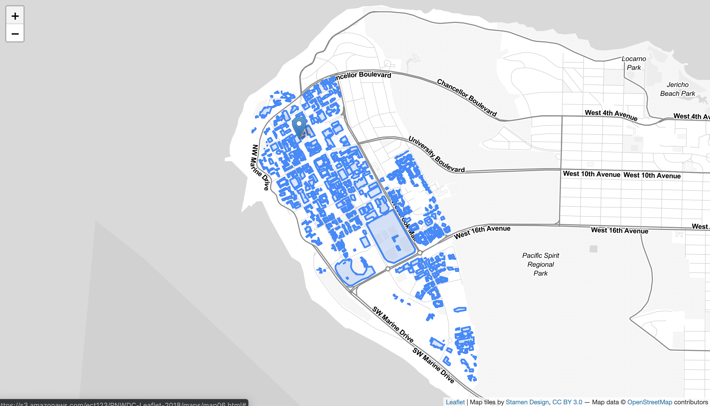

# Change Base Map

Suppose we want our data to stand out from the green base map more than it does now. One thing we can do is change the source of the map tiles to one that has a more appropriate style for our blue data. As mentioned earlier, there are several out of the box options to choose from with a variety of different styles. [This page lists a number of different map tile sources](https://leaflet-extras.github.io/leaflet-providers/preview/), and provides the text to paste into our map document for each one (minus the important <code>.addTo(mymap)</code> which needs to be inserted before the final semi-colon). **some of these sources require an access token, so you won't be able to use them unless you sign up for an account**. For our data, let's choose the Stamen.TonerLite tiles since they're lightly colored and they don't require an access token.   


To Do
{: .label .label-green }
- Copy the text below and replace the existing map tile variable in your HTML document.


```js
var Stamen_TonerLite = L.tileLayer('https://stamen-tiles-{s}.a.ssl.fastly.net/toner-lite/{z}/{x}/{y}{r}.{ext}', {
	attribution: 'Map tiles by <a href="http://stamen.com">Stamen Design</a>, <a href="http://creativecommons.org/licenses/by/3.0">CC BY 3.0</a> &mdash; Map data &copy; <a href="https://www.openstreetmap.org/copyright">OpenStreetMap</a> contributors',
	subdomains: 'abcd',
	minZoom: 0,
	maxZoom: 20,
	ext: 'png'
}).addTo(mymap);
```    

If it all went as planned, you should see a map like this in your browser:    



