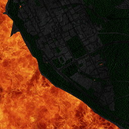
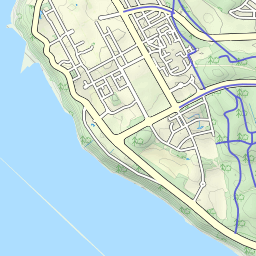
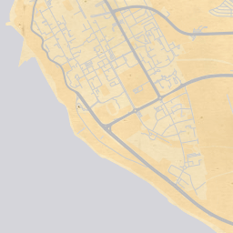

# Map Tiles

Map tiles are squares of geographic data that are loaded to your frame of view whenever you zoom or pan your map. Each tile is a 256px x 256px (traditionally a .png image at roughly 20-40kb each), making them quick to load over an internet connection. These tiles provide a geographic reference for other data layers that might be added later (we'll get to that in a minute). You've probably noticed them if you've had choppy internet connection and had to wait for data to load:    

    

Every time you pan your map, new tiles are loaded to fill that frame of view. The tiles outside of that view are not loaded because loading the entire world's tiles would be time consuming, especially if you were just focused on a small area. When you zoom in or out, new tiles are loaded to correspond with the level of detail needed at each **zoom level**.    

##Zoom Levels
Because web maps refresh content as you zoom in, they don't have a traditional map scale. Instead, there are different levels associated with the amount of detail shown on the map.
Web maps typically have around 20 zoom numbered levels. Zoom level 0 has the least amount of detail, and is from a viewpoint as far away as earth as it gets. As the zoom level number goes up, so does the detail. Zoom level 18 has enough detail that displaying building titles makes sense. Zoom level 0 consisting of only 1 tile for the entire world (this zoom level loads the fastest!). Zoom level 18 consists of around 69 billion tiles. That's a lot of data!!!!    

Level 0 | Level 18
--- | ---
 | 
1 tile covers the world| 69 billion tiles cover the world    

<!-- Here's the map tile grid for **zoom level 11 over Vancouver**:    
   

Here's the map tile grid for **zoom level 13 over Vancouver**:    
   
-->

## Tile Servers  
You might be thinking: ***Where are all these tiles loading from?*** Well, there are services that render these tiles for consumption. The main two being Google and [OpenStreetMap](https://wiki.openstreetmap.org/wiki/Tile_servers), but there are many others.     

You might also be thinking: ***Can I customize my own tiles to make them look cool?*** You can, with services like [Mapbox Studio](https://www.mapbox.com/mapbox-studio/). Or you can [set up your own server](https://medium.com/@Nithanaroy/create-your-own-tile-server-and-map-client-5f7515fff28) to render your own. But these options are both way beyond the scope of this workshop, so for now, don't worry about it. There are several out-of-the-box options to make your map tiles look sleek.    

Here are some interesting styles for the tile covering the south part of UBC Campus at zoom level 13:    

    
    

## Raster and Vector Tiles    
Another thing to understand about map tiles is that there are both raster and vector tiles. Raster tiles have been around longer, and so are a little simpler to tinker with when learning about and tinkering with web maps. This is why we're using raster tiles for this workshop. Features and attributes on raster tiles are static because they're just images, and there are other limitations on the way we can view and interact with them.    

Vector tiles contain vector data like feature names and other attribute data. While they have been around for several years, they are still newer and faster, and offer more customization options than raster tiles. These tiles are rendered as soon as your browser requests them from the tile server, freeing us from discrete zoom levels and map orientation. [Here's an example](https://openmaptiles.github.io/klokantech-terrain-gl-style/#13.88/49.2567/-123.2454/3.3/44).
