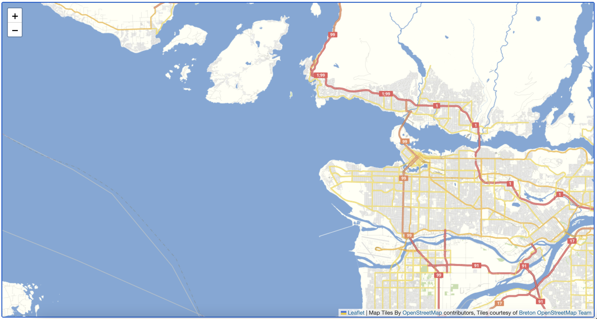

# Configure the Starting View

Ok so we have our map boilerplate, and its a good starting point for making a map of UBC. One thing that we’ll notice is that when the map loads, it’s just starting over Vancouver, and not UBC. So let’s change that.

In the <code>mymap</code> variable you can see a couple of recognizable elements - most noticeably the latitude and longitude coordinate pair (49.2827, -123.1207). That location is the geographic center point for the city of Vancouver. When your browser loads the map, it starts with that point in the center of your screen.

Say we want to load the map over UBC, which is about 5 km to the west. We'd need to change that coordinate pair to be the center point of UBC. There are several ways to find this, but an easy one is to use [latlong.net](https://www.latlong.net/). Type in UBC in latlong.net, and you return a coordinate pair of 49.260605 and -123.245995.

To Do
{: .label .label-green }
- Modify the coordinate pair so your map loads over UBC.

Save your .html file, and reload your browser. If everything went as planned, you should see this:




If you don't see a map like the one above, undo your edit in your source code editor (**ctl + z**), and save (**ctl + s**) when it's working again. At that point try again making sure your code syntax is exactly as shown:

```javascript
var mymap = L.map('mapid').setView([49.260605, -123.245995], 11);
```

## Zoom Levels
Your map currently loads at a zoom level which requires a user to zoom in immediately toward UBC. Ideally, if this map is meant to show information for UBC's campus, it would load as close to campus as possible, but not so close that different screen dimensions cut off parts of the campus area. So we'll need to change the loading zoom level.

Looking again at our <code>mymap</code> variable, the loading view is set at the coordinate pair over UBC, and at a zoom level of 11. In our case, the map best loads at zoom level 14.

To Do
{: .label .label-green }
- Change your loading zoom level your map loads at zoom level 14.    

You should see this if you save and refresh your map:


