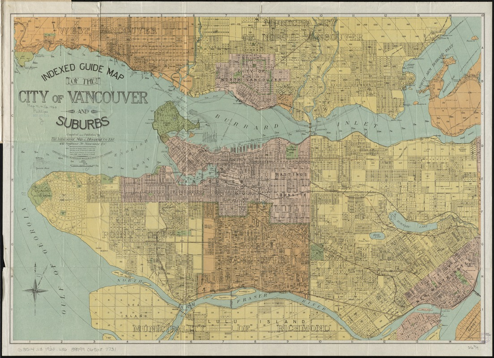

# "Digital" vs "Web" Map

While we're talking about maps loading and working in the web, let's also talk the difference between a **web map** and a **digital map**. The term digital map is used quite often. As a benchmark, Wikipedia's entry for "Digital Mapping" is:
> The process by which a collection of data is compiled and formatted into a virtual image.    

### Digital Maps
More specifically to our workshop, a digital map is a map that was somehow derived from a computer. Sometimes we use this term to refer to scanned paper maps since they've been digitally reformatted like this old map of Vancouver:

    
[Map reproduction courtesy of the Norman B. Leventhal Map & Education Center at the Boston Public Library](https://collections.leventhalmap.org/search/commonwealth:4m90fg11z)     

More commonly, we use this term for "born digital" maps like this cycling map from the City of Vancouver. This map was likely constructed with geospatial data and a Geographic Information System (GIS), and published at a static scale and dimension.

     

[Front of City of Vancouver Cycling 2019 Map](https://vancouver.ca/streets-transportation/cycling-routes-maps-and-trip-planner.aspx)

### Web Maps
Using the definition above, a web map is a type of digital map since it is derived from a computer. However there are some important differences:
- **Web maps have dynamic scales and content**. For instance when you zoom in, more information may appear that wasn't apparent before. For this reason, web maps are not designed for print.
- **Interactive**. This has been stated already, but web maps are built to be interacted with - usually by an end user.
- **Often relies on web and mobile technology**.    
We see web maps all the time in the web, and usually we think of [Google Maps](https://www.google.com/maps/embed?pb=!1m14!1m12!1m3!1d10414.983406806172!2d-123.24297379757083!3d49.26226286690077!2m3!1f0!2f0!3f0!3m2!1i1024!2i768!4f13.1!5e0!3m2!1sen!2sca!4v1542068116121) as a familiar example. For small businesses, web maps are helpful for [finding directions](https://luppolobrewing.ca/contact/). For app builders, web maps might provide a [method for routing to locations](https://www.pogomap.info/) using a mobile device's geolocation features. For researchers, they may help [communicate important information](https://www.uvic.ca/research/centres/cisur/projects/map/index.php) in an area of study. For journalists, they may help [provide perspective on a story in the news](https://www.nytimes.com/interactive/2018/upshot/election-2016-voting-precinct-maps.html#4.04/39.97/-84.35).

In any case, web maps are a canvas for visualizing and interacting with geographic data.
